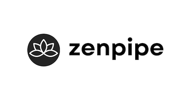

# ZenPipe

<div style="display: flex; flex-direction: row; align-items: center; gap: 10px; margin-bottom: 10px;">
  <a href="https://github.com/dynamik-dev/zenpipe-php/actions/workflows/CI.yml">
    
  </a>
  <a href="https://buymeacoffee.com/chrisarter">
    
  </a>
</div>

<p align="center">
  
</p>

ZenPipe is a simple and flexible PHP pipeline library that allows you to chain operations together to process, transform, or act on input.

```php
$calculator = zenpipe()
   ->pipe(fn($price, $next) => $next($price * 0.8)) // 20% discount
   ->pipe(fn($price, $next) => $next($price * 1.1)); // add 10% tax

$calculator(100); // $88 (100 -> 80 -> 88)
```

You can also run the pipeline on demand:

```php
zenpipe(100)
   ->pipe(fn($price, $next) => $next($price * 0.8)) // 20% discount
   ->pipe(fn($price, $next) => $next($price * 1.1)) // add 10% tax
   ->process(); // 88
```

## Sections

1. [ZenPipe](#zenpipe)
2. [Requirements](#requirements)
3. [Installation](#installation)
4. [Usage](#usage)
   - [Pipeline Operations](#pipeline-operations)
   - [Class Methods as Operations](#class-methods-as-operations)
   - [Context Passing](#context-passing)
   - [Exception Handling](#exception-handling)
   - [PSR-15 Middleware](#psr-15-middleware)
   - [More Examples](#more-examples)
5. [API Reference](#api-reference)
6. [Contributing](#contributing)
7. [License](#license)

## Requirements

- PHP 8.2 or higher

## Installation

```bash
composer require dynamik-dev/zenpipe-php
```

## Usage

### Pipeline Operations

Pipeline operations are functions that take an input and return a processed value. Each operation can receive up to four parameters:

- `$input`: The value being processed
- `$next`: A callback to pass the value to the next operation
- `$return`: (Optional) A callback to exit the pipeline early with a value
- `$context`: (Optional) A shared context object passed to all operations

#### Basic Operation Example

Let's build an input sanitization pipeline:

```php
// String sanitization pipeline
$sanitizer = zenpipe()
    ->pipe(fn($input, $next) => $next(trim($input)))
    ->pipe(fn($input, $next) => $next(preg_replace('/\s+/', ' ', $input)))
    ->pipe(fn($input, $next) => $next(strip_tags($input)))
    ->pipe(fn($input, $next) => $next(htmlspecialchars($input)))
    ->pipe(fn($input, $next) => $next(mb_convert_encoding(
        $input, 'UTF-8', mb_detect_encoding($input)
    )));

// Usage examples:
$dirtyInput = "  <script>alert('xss')</script>  Hello   World! ¥€$ ";
$cleanInput = $sanitizer($dirtyInput);
// Output: "Hello World! ¥€$"

// Can also be run on demand:
$result = zenpipe($dirtyInput)
    ->pipe(fn($input, $next) => $next(trim($input)))
    ->pipe(fn($input, $next) => $next(strip_tags($input)))
    ->process();
```

#### Operation with Early Return

Below is a practical example of a content moderation pipeline with early returns:

```php
// Content moderation pipeline with early returns
$moderationPipeline = zenpipe()
    ->pipe(function($content, $next, $return) {
        // Skip moderation for trusted authors
        if (Auth::user()->isTrusted()) {
            return $return([
                'status' => 'approved',
                'content' => $content,
                'skipped' => true
            ]);
        }
        return $next($content);
    })
    ->pipe(function($content, $next, $return) {
        // Quick check for banned words
        if (containsBannedWords($content)) {
            return $return([
                'status' => 'rejected',
                'reason' => 'prohibited_content'
            ]);
        }
        return $next($content);
    })
    ->pipe(function($content, $next) {
        // Send to AI moderation for nuanced analysis
        return $next(
            AI::moderate($content)
        );
    });

// Usage:
$result = $moderationPipeline("Hello, world!");
// Trusted user: Immediately returns approved
// Regular user: Goes through full moderation
```

### Class Methods as Operations

You can also use class methods as operations, with the same parameter options:

```php
class MyClass
{
    public function validate($input, $next, $return)
    {
        if (empty($input)) {
            return $return('Input cannot be empty');
        }
        return $next(strtoupper($input));
    }
}

$pipeline = zenpipe()
   ->pipe([MyClass::class, 'validate']);
```

You can also pass an array of operations:

```php
$pipeline = zenpipe()
   ->pipe([
        fn($input, $next) => $next(strtoupper($input)),
        [MyClass::class, 'validate']
    ]);
```

### Context Passing

You can pass a shared context object to all operations using `withContext()`. This is useful for sharing state, configuration, or dependencies across the pipeline without threading them through the value.

```php
// Use any object as context - your own DTO, stdClass, or array
class RequestContext
{
    public function __construct(
        public string $userId,
        public array $permissions,
        public array $logs = []
    ) {}
}

$context = new RequestContext(
    userId: 'user-123',
    permissions: ['read', 'write']
);

$result = zenpipe(['action' => 'update', 'data' => [...]])
    ->withContext($context)
    ->pipe(function ($request, $next, $return, RequestContext $ctx) {
        if (!in_array('write', $ctx->permissions)) {
            return $return(['error' => 'Unauthorized']);
        }
        $ctx->logs[] = "Permission check passed for {$ctx->userId}";
        return $next($request);
    })
    ->pipe(function ($request, $next, $return, RequestContext $ctx) {
        $ctx->logs[] = "Processing {$request['action']}";
        return $next([...$request, 'processed_by' => $ctx->userId]);
    })
    ->process();

// Context is mutable - logs are accumulated across operations
// $context->logs = ['Permission check passed for user-123', 'Processing update']
```

Type hint your context parameter in the operation signature for IDE support:

```php
/** @var ZenPipe<array, RequestContext> */
$pipeline = zenpipe()
    ->withContext(new RequestContext(...))
    ->pipe(fn($value, $next, $return, RequestContext $ctx) => ...);
```

### Exception Handling

Use `catch()` to handle exceptions gracefully without breaking the pipeline:

```php
$result = zenpipe($userData)
    ->pipe(fn($data, $next) => $next(validateInput($data)))
    ->pipe(fn($data, $next) => $next(processPayment($data))) // might throw
    ->pipe(fn($data, $next) => $next(sendConfirmation($data)))
    ->catch(fn(Throwable $e, $originalValue) => [
        'error' => $e->getMessage(),
        'input' => $originalValue,
    ])
    ->process();
```

The catch handler receives:

- `$e`: The thrown exception (`Throwable`)
- `$value`: The original input value passed to `process()`
- `$context`: The context set via `withContext()` (null if not set)

If no catch handler is set, exceptions propagate normally.

### PSR-15 Middleware

ZenPipe provides bidirectional PSR-15 middleware support. Requires `psr/http-server-middleware`.

#### Using PSR-15 Middleware in a Pipeline

Pass any `MiddlewareInterface` directly to `pipe()`:

```php
$response = zenpipe($request)
    ->pipe(new CorsMiddleware())
    ->pipe(new AuthMiddleware())
    ->pipe(fn($req, $next, $return) => $return(new Response(200)))
    ->process();
```

When using PSR-15 middleware, the pipeline must return a `ResponseInterface`.

#### Using ZenPipe as PSR-15 Middleware

Wrap a pipeline with `asMiddleware()` for use in PSR-15 frameworks:

```php
$pipeline = zenpipe()
    ->pipe(fn($req, $next) => $next($req->withAttribute('processed', true)));

$app->middleware($pipeline->asMiddleware());
```

**Behavior:**
- If the pipeline returns a `ResponseInterface`, it's returned directly
- If the pipeline returns a `ServerRequestInterface`, it's passed to the next handler
- The PSR-15 handler is available via `$context->handler` for explicit delegation

```php
$authPipeline = zenpipe()
    ->pipe(function ($req, $next, $return, $ctx) {
        if (!$req->hasHeader('Authorization')) {
            return $return(new Response(401));
        }
        return $ctx->handler->handle($req);
    });

$app->middleware($authPipeline->asMiddleware());
```

### More Examples

#### RAG Processes

This pipeline can be used for RAG processes, where the output of one model is used as input for another.

```php
$ragPipeline = zenpipe()
    ->pipe(fn($query, $next) => $next([
        'query' => $query,
        'embeddings' => OpenAI::embeddings()->create([
            'model' => 'text-embedding-3-small',
            'input' => $query
        ])->embeddings[0]->embedding
    ]))
    ->pipe(fn($data, $next) => $next([
        ...$data,
        'context' => Qdrant::collection('knowledge-base')
            ->search($data['embeddings'], limit: 3)
            ->map(fn($doc) => $doc->content)
            ->join("\n")
    ]))
    ->pipe(fn($data, $next) => $next(
        OpenAI::chat()->create([
            'model' => 'gpt-4-turbo-preview',
            'messages' => [
                [
                    'role' => 'system',
                    'content' => 'Answer using the provided context only.'
                ],
                [
                    'role' => 'user',
                    'content' => "Context: {$data['context']}\n\nQuery: {$data['query']}"
                ]
            ]
        ])->choices[0]->message->content
    ));

$answer = $ragPipeline("What's our refund policy?");
```

#### Email Validation with Early Return

This pipeline demonstrates early returns for email validation:

```php
$emailValidationPipeline = zenpipe()
    ->pipe(function($input, $next, $return) {
        if (!is_string($input)) {
            return $return('Input must be a string');
        }
        return $next(filter_var($input, FILTER_VALIDATE_EMAIL));
    })
    ->pipe(function($email, $next, $return) {
        if (!$email) {
            return $return('Invalid email format');
        }

        $domain = substr(strrchr($email, "@"), 1);
        $mxhosts = [];

        if (!getmxrr($domain, $mxhosts)) {
            return $return('Domain has no valid mail servers');
        }

        return $next(true);
    });

$result = $emailValidationPipeline('example@example.com');
// Returns: 'Domain has no valid mail servers'

$result = $emailValidationPipeline('invalid-email');
// Returns: 'Invalid email format'
```

## API Reference

See [API Reference](docs/API.md) for details.

## Contributing

See [CONTRIBUTING.md](CONTRIBUTING.md) for details.

## License

The MIT License (MIT). See [LICENSE](LICENSE) for details.
